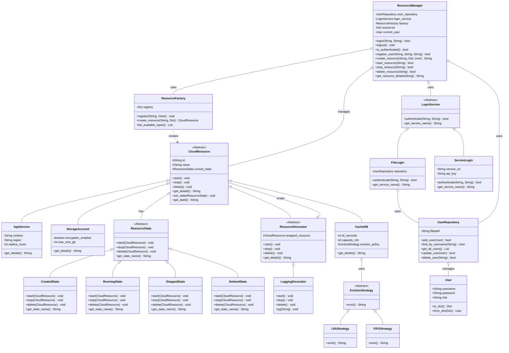
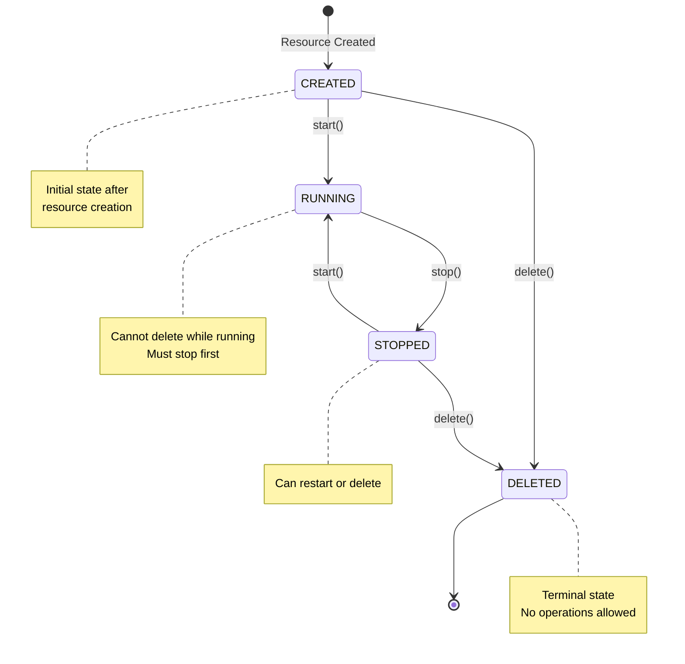
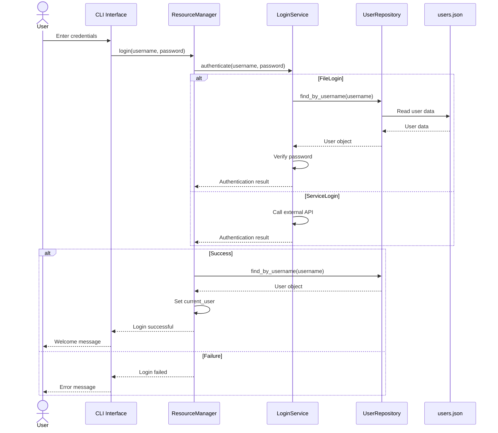
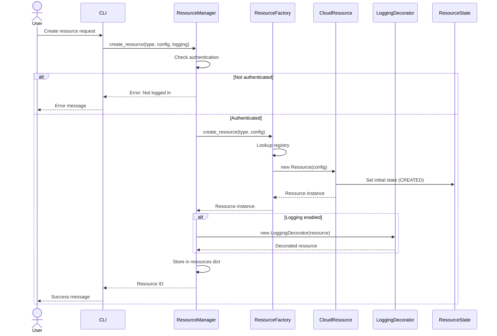

# Cloud Resource Management System - Architecture Documentation

## Table of Contents
1. [System Overview](#system-overview)
2. [Architecture Layers](#architecture-layers)
3. [Component Diagrams](#component-diagrams)
4. [Design Patterns](#design-patterns)
5. [Data Flow](#data-flow)
6. [SOLID Principles](#solid-principles)
7. [Extension Points](#extension-points)

---

## System Overview

The Cloud Resource Management System is a modular, extensible application for managing cloud resources (AppService, StorageAccount, CacheDB) with user authentication, lifecycle management, and logging capabilities.

### Key Features
- **Multi-resource support**: AppService, StorageAccount, CacheDB
- **User authentication**: File-based and service-based login
- **Lifecycle management**: State-based resource transitions (Created → Running → Stopped → Deleted)
- **Extensibility**: Plugin architecture for new resource types
- **Cross-cutting concerns**: Optional logging via decorators
- **Persistence**: JSON-based user repository

### Technology Stack
- **Language**: Python 3.x
- **Persistence**: JSON files
- **Architecture**: Layered architecture with design patterns
- **Interface**: CLI (Command Line Interface)

---

## Architecture Layers

The system follows a layered architecture with clear separation of concerns:

```
┌─────────────────────────────────────────────────────────────┐
│                    Presentation Layer                        │
│  (main.py, main_with_auth.py, demo_resource_manager.py)    │
│                     CLI Interface                            │
└─────────────────────────────────────────────────────────────┘
                            │
                            ▼
┌─────────────────────────────────────────────────────────────┐
│                   Application Layer                          │
│              (resource_manager.py)                           │
│         Orchestration & Business Logic                       │
└─────────────────────────────────────────────────────────────┘
                            │
                            ▼
┌─────────────────────────────────────────────────────────────┐
│                     Domain Layer                             │
│  (cloud_resource.py, resource_state.py,                     │
│   eviction_strategy.py)                                      │
│              Core Business Entities                          │
└─────────────────────────────────────────────────────────────┘
                            │
                            ▼
┌─────────────────────────────────────────────────────────────┐
│                 Infrastructure Layer                         │
│  (user_repository.py, login_service.py,                     │
│   resource_factory.py, resource_decorator.py)               │
│         Technical Services & Utilities                       │
└─────────────────────────────────────────────────────────────┘
                            │
                            ▼
┌─────────────────────────────────────────────────────────────┐
│                    Persistence Layer                         │
│              (users.json, demo_users.json)                   │
│                   Data Storage                               │
└─────────────────────────────────────────────────────────────┘
```

---

## Component Diagrams

### 1. Complete System Architecture

```mermaid
graph TB
    subgraph "Presentation Layer"
        CLI[CLI Interface<br/>main_with_auth.py]
        SimpleCLI[Simple CLI<br/>main.py]
        Demo[Demo Script<br/>demo_resource_manager.py]
    end
    
    subgraph "Application Layer"
        RM[ResourceManager<br/>Facade & Orchestration]
    end
    
    subgraph "Domain Layer"
        CR[CloudResource<br/>Abstract Base]
        AS[AppService]
        SA[StorageAccount]
        CD[CacheDB]
        
        RS[ResourceState<br/>Interface]
        CS[CreatedState]
        RNS[RunningState]
        STS[StoppedState]
        DS[DeletedState]
        
        ES[EvictionStrategy<br/>Interface]
        LRU[LRUStrategy]
        FIFO[FIFOStrategy]
    end
    
    subgraph "Infrastructure Layer"
        RF[ResourceFactory<br/>Registry Pattern]
        RD[ResourceDecorator<br/>Abstract]
        LD[LoggingDecorator]
        
        LS[LoginService<br/>Interface]
        FL[FileLogin]
        SL[ServiceLogin]
        
        UR[UserRepository]
        U[User Entity]
    end
    
    subgraph "Persistence Layer"
        JSON[(users.json)]
    end
    
    CLI --> RM
    SimpleCLI --> RF
    Demo --> RM
    
    RM --> RF
    RM --> UR
    RM --> LS
    RM --> CR
    
    RF --> CR
    RF --> AS
    RF --> SA
    RF --> CD
    
    CR --> RS
    AS -.inherits.-> CR
    SA -.inherits.-> CR
    CD -.inherits.-> CR
    CD --> ES
    
    RS <-.implements.- CS
    RS <-.implements.- RNS
    RS <-.implements.- STS
    RS <-.implements.- DS
    
    ES <-.implements.- LRU
    ES <-.implements.- FIFO
    
    RD -.inherits.-> CR
    LD -.inherits.-> RD
    RD --> CR
    
    LS <-.implements.- FL
    LS <-.implements.- SL
    FL --> UR
    
    UR --> U
    UR --> JSON
```

### 2. Detailed Class Diagram



### 3. State Transition Diagram



### 4. Authentication Flow Diagram



### 5. Resource Creation Flow



---

## Design Patterns

### 1. Factory Method Pattern (Creational)

**Purpose**: Dynamic resource creation with registry mechanism

**Implementation**: `ResourceFactory` class

**Benefits**:
- Decouples client code from concrete resource classes
- Supports runtime registration of new resource types
- No modification needed to add new resources (Open/Closed Principle)

**Code Example**:
```python
factory = ResourceFactory()
factory.register("AppService", AppService)
resource = factory.create_resource("AppService", config)
```

### 2. State Pattern (Behavioral)

**Purpose**: Manage resource lifecycle with valid state transitions

**Implementation**: `ResourceState` hierarchy

**Benefits**:
- Encapsulates state-specific behavior
- Prevents invalid operations (e.g., deleting running resource)
- Clean separation of state logic (Single Responsibility Principle)

**State Transitions**:
- CREATED → RUNNING (start)
- CREATED → DELETED (delete)
- RUNNING → STOPPED (stop)
- STOPPED → RUNNING (start)
- STOPPED → DELETED (delete)

### 3. Decorator Pattern (Structural)

**Purpose**: Add logging functionality without modifying resource classes

**Implementation**: `LoggingDecorator` wraps `CloudResource`

**Benefits**:
- Runtime attachment of cross-cutting concerns
- Maintains resource class purity
- Flexible composition (can add multiple decorators)

**Code Example**:
```python
resource = factory.create_resource("AppService", config)
logged_resource = LoggingDecorator(resource)
logged_resource.start()  # Logs and delegates to wrapped resource
```

### 4. Strategy Pattern (Behavioral)

**Purpose**: Interchangeable cache eviction algorithms

**Implementation**: `EvictionStrategy` interface with LRU/FIFO implementations

**Benefits**:
- Runtime algorithm selection
- Easy to add new eviction policies
- Decouples algorithm from CacheDB class

**Code Example**:
```python
strategy = LRUStrategy() if policy == 'LRU' else FIFOStrategy()
cache = CacheDB(id, name, ttl, capacity, strategy)
```

### 5. Repository Pattern (Architectural)

**Purpose**: Abstract data access and persistence

**Implementation**: `UserRepository` class

**Benefits**:
- Centralized data access logic
- Easy to swap storage backends (JSON → Database)
- Testability through mock repositories

**Code Example**:
```python
repo = UserRepository("users.json")
user = repo.find_by_username("alice")
repo.add_user(new_user)
```

### 6. Facade Pattern (Structural)

**Purpose**: Simplify complex subsystem interactions

**Implementation**: `ResourceManager` class

**Benefits**:
- Single entry point for resource operations
- Coordinates authentication, factory, and resources
- Reduces client complexity

### 7. Strategy Pattern (Authentication)

**Purpose**: Pluggable authentication mechanisms

**Implementation**: `LoginService` interface with FileLogin/ServiceLogin

**Benefits**:
- Runtime switching between authentication methods
- Easy to add new authentication providers
- Decoupled from ResourceManager

---

## Data Flow

### Resource Creation with Authentication

```
User Input
    ↓
CLI Interface (main_with_auth.py)
    ↓
ResourceManager.create_resource()
    ↓
[Check Authentication] → LoginService.authenticate()
    ↓                           ↓
[Authenticated]          UserRepository.find_by_username()
    ↓                           ↓
ResourceFactory.create_resource()  users.json
    ↓
[Registry Lookup]
    ↓
Concrete Resource (AppService/StorageAccount/CacheDB)
    ↓
[Optional] LoggingDecorator wraps resource
    ↓
Store in ResourceManager.resources
    ↓
Return Resource ID to CLI
    ↓
Display to User
```

### Resource State Transition

```
User Command (start/stop/delete)
    ↓
CLI Interface
    ↓
ResourceManager.start_resource(id)
    ↓
[Check Authentication]
    ↓
Get Resource from resources dict
    ↓
CloudResource.start()
    ↓
Delegate to current_state.start(resource)
    ↓
State validates transition
    ↓
[Valid] → resource.set_state(new_state)
[Invalid] → raise ValueError
    ↓
Return to CLI
```

---

## SOLID Principles

### Single Responsibility Principle (SRP)
- **CloudResource**: Manages resource identity and delegates state operations
- **ResourceState**: Each state class handles only its specific state logic
- **UserRepository**: Only responsible for user data persistence
- **LoginService**: Only handles authentication logic
- **ResourceFactory**: Only creates resources
- **LoggingDecorator**: Only adds logging behavior

### Open/Closed Principle (OCP)
- **ResourceFactory**: Open for extension (new resource types), closed for modification
- **EvictionStrategy**: New strategies can be added without changing CacheDB
- **LoginService**: New authentication methods without changing ResourceManager

### Liskov Substitution Principle (LSP)
- All `CloudResource` subclasses can be used interchangeably
- All `ResourceState` implementations are substitutable
- All `LoginService` implementations work with ResourceManager

### Interface Segregation Principle (ISP)
- **ResourceState**: Focused interface with only lifecycle methods
- **EvictionStrategy**: Single method interface
- **LoginService**: Minimal authentication interface

### Dependency Inversion Principle (DIP)
- **ResourceManager** depends on abstractions:
  - `LoginService` interface (not FileLogin/ServiceLogin)
  - `CloudResource` abstract class (not concrete resources)
- **CacheDB** depends on `EvictionStrategy` interface (not LRU/FIFO)
- **FileLogin** depends on `UserRepository` abstraction

---

## Extension Points

### Adding New Resource Types

1. Create new class inheriting from `CloudResource`
2. Implement `get_details()` method
3. Register with factory: `factory.register("NewType", NewResourceClass)`
4. No changes needed to existing code

**Example**:
```python
class DatabaseService(CloudResource):
    def __init__(self, resource_id, name, engine, size):
        super().__init__(resource_id, name)
        self.engine = engine
        self.size = size
    
    def get_details(self):
        return f"DatabaseService[{self.id}]: {self.name}\n  Engine: {self.engine}"

# Register
factory.register("DatabaseService", DatabaseService)
```

### Adding New States

1. Create new class inheriting from `ResourceState`
2. Implement all abstract methods
3. Update transition logic in existing states

### Adding New Eviction Strategies

1. Create new class inheriting from `EvictionStrategy`
2. Implement `evict()` method
3. Update factory logic to support new strategy

### Adding New Authentication Methods

1. Create new class inheriting from `LoginService`
2. Implement `authenticate()` and `get_service_name()`
3. Pass to ResourceManager constructor

**Example**:
```python
class OAuthLogin(LoginService):
    def authenticate(self, username, password):
        # OAuth implementation
        pass
    
    def get_service_name(self):
        return "OAuth 2.0 Authentication"

# Use
oauth = OAuthLogin(client_id, client_secret)
manager = ResourceManager(repo, oauth)
```

### Switching Storage Backend

Replace `UserRepository` implementation:
```python
class DatabaseUserRepository(UserRepository):
    def __init__(self, connection_string):
        self.db = connect(connection_string)
    
    def find_by_username(self, username):
        # SQL query implementation
        pass
```

---

## Component Responsibilities

| Component | Responsibility | Pattern |
|-----------|---------------|---------|
| `CloudResource` | Abstract base for all resources | Template Method |
| `AppService`, `StorageAccount`, `CacheDB` | Concrete resource implementations | Factory Method |
| `ResourceState` | Define state behavior interface | State Pattern |
| `CreatedState`, `RunningState`, etc. | Implement state-specific logic | State Pattern |
| `ResourceFactory` | Create resources dynamically | Factory + Registry |
| `ResourceDecorator` | Base for decorators | Decorator Pattern |
| `LoggingDecorator` | Add logging to resources | Decorator Pattern |
| `EvictionStrategy` | Define eviction interface | Strategy Pattern |
| `LRUStrategy`, `FIFOStrategy` | Implement eviction algorithms | Strategy Pattern |
| `User` | User entity | Domain Model |
| `UserRepository` | User data persistence | Repository Pattern |
| `LoginService` | Authentication interface | Strategy Pattern |
| `FileLogin`, `ServiceLogin` | Authentication implementations | Strategy Pattern |
| `ResourceManager` | Orchestrate all operations | Facade Pattern |
| `main_with_auth.py` | CLI with authentication | Presentation Layer |
| `main.py` | Simple CLI without auth | Presentation Layer |

---

## File Structure

```
cloud_resource_management/
├── cloud_resource.py          # Core resource abstractions
├── resource_state.py          # State pattern implementation
├── eviction_strategy.py       # Strategy pattern for eviction
├── resource_factory.py        # Factory with registry
├── resource_decorator.py      # Decorator pattern for logging
├── user_repository.py         # Repository pattern for users
├── login_service.py           # Authentication services
├── resource_manager.py        # Facade for orchestration
├── main.py                    # Simple CLI
├── main_with_auth.py          # CLI with authentication
├── demo_resource_manager.py   # Demo script
├── users.json                 # User data storage
├── demo_users.json            # Demo user data
├── ARCHITECTURE.md            # This document
├── Design.md                  # Original design document
└── README_RESOURCE_MANAGER.md # Resource manager documentation
```

---

## Conclusion

This architecture provides a robust, extensible foundation for cloud resource management with clear separation of concerns, adherence to SOLID principles, and strategic use of design patterns. The system can easily accommodate new resource types, authentication methods, and business logic without modifying existing code.
